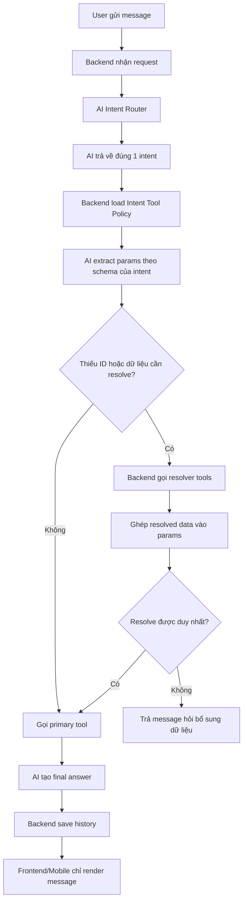
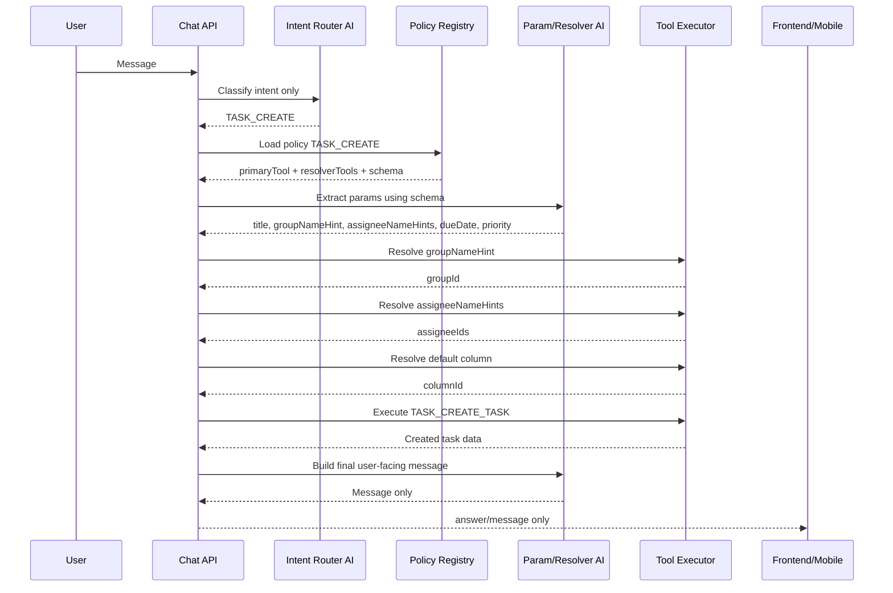

# Plan: AI Assistant Intent → Tool Flow

## Tóm tắt quyết định

AI Assistant nên chạy theo flow 3 tầng:

1. **Intent Router**: AI chỉ phân tích message và trả về đúng 1 `intent`.
2. **Intent Tool Policy**: Backend dựa trên `intent` để chọn bộ tool hợp lệ, gồm tool chính và các resolver tool phụ.
3. **Tool Executor**: Backend/AI tự resolve dữ liệu còn thiếu, sau đó gọi tool chính để get/update data và trả về message cuối cho user.

Nguyên tắc quan trọng:

- Không bắt user confirm trước khi chạy thao tác.
- Không expose `intent`, `tool`, `tool data` ra UI.
- UI chỉ hiển thị `message` cuối cùng.
- Schema gửi lên AI phải phân biệt rõ trường bắt buộc và trường tùy chọn.
- Với thao tác tạo task, trường tối thiểu bắt buộc ở mức AI schema chỉ là `title`/`name`.
- Tuy nhiên ở mức business, nếu backend cần `groupId` để insert task thì `groupId` hoặc `groupNameHint` là dữ liệu bắt buộc để thực thi.
- Các trường như `columnId`, `assigneeIds`, `assigneeNameHints`, `dueDate`, `priority`, `description` là optional và có thể resolve/fallback.
- Ưu tiên dùng ID nếu có; nếu không có ID thì dùng hint theo tên để resolver tool lấy ID.
- Nếu thiếu field bắt buộc để thực thi thì không gọi primary tool, AI phải trả message nói rõ thiếu trường nào.
- Hạn chế/xóa các nhánh fallback hard-code bằng code; message cuối nên do AI sinh từ tool result hoặc missing-field context.

## Danh sách intent

```java
AI_CAPABILITIES,
SMALL_TALK,
GENERAL_QA,
LIST_CONVERSATIONS,
LIST_MESSAGES,
SEARCH_KEYWORD,
SEARCH_SEMANTIC,
SEARCH_MY_CHAT_SPACE,
FIND_WHO_SAID,
TASK_LIST_GROUPS,
TASK_FIND_BY_NAME,
TASK_LIST_GROUP_ITEMS,
TASK_CREATE,
TASK_UPDATE,
TASK_DELETE,
TASK_DETAIL,
TASK_COMMENT_CREATE,
TASK_COMMENT_LIST,
TASK_LIST_MY_ITEMS,
TASK_LIST_OVERDUE,
TASK_LIST_DUE_SOON,
SUMMARIZE_CONVERSATION,
UNKNOWN
```

## Flow tổng quát



## Không confirm user

Flow không có bước:

```text
Bạn có chắc muốn tạo/cập nhật/xóa không?
```

AI/Backend chạy luôn khi đã đủ dữ liệu.

Chỉ hỏi lại user trong trường hợp thiếu dữ liệu bắt buộc hoặc không thể tự resolve dữ liệu, ví dụ:

- Có nhiều user cùng tên `Đào Đức Danh`.
- Có nhiều nhóm task cùng tên gần giống `Task KTPM`.
- Không có group mặc định và user cũng không nói nhóm task nào.
- Tạo task nhưng user chỉ nói tên task, deadline, priority, assignee mà không nói nhóm task.

Đây là hỏi bổ sung dữ liệu, không phải confirm thao tác.

Ví dụ thiếu nhóm task:

User gửi:

```text
Hãy tạo task với tên là "API đăng nhập", deadline ngày mai, ưu tiên HIGH, gắn cho user "Đào Đức Danh"
```

AI/Backend extract được:

```json
{
  "title": "API đăng nhập",
  "dueDate": "2026-06-04",
  "priority": "HIGH",
  "assigneeNameHints": [
    "Đào Đức Danh"
  ]
}
```

Nhưng thiếu `groupId`/`groupNameHint`, mà task-service cần nhóm task để insert.

Không gọi `TASK_CREATE_TASK`.

AI trả message:

```text
Mình cần biết task này thuộc nhóm task nào để tạo. Bạn cho mình tên nhóm task nhé.
```

## Intent Tool Policy

Mỗi intent nên có config cố định trong backend.

Ví dụ:

```json
{
  "intent": "TASK_CREATE",
  "primaryTool": "TASK_CREATE_TASK",
  "resolverTools": [
    "TASK_FIND_GROUP_BY_NAME",
    "TASK_GET_GROUP_BY_ID",
    "USER_FIND_BY_NAME",
    "TASK_GET_DEFAULT_COLUMN"
  ],
  "requiredParams": [
    "title"
  ],
  "businessRequiredParams": [
    "groupId hoặc groupNameHint"
  ],
  "optionalParams": [
    "description",
    "groupId",
    "groupNameHint",
    "columnId",
    "columnNameHint",
    "assigneeIds",
    "assigneeNameHints",
    "startDate",
    "dueDate",
    "priority"
  ]
}
```

## AI_CAPABILITIES

Với intent `AI_CAPABILITIES`, backend không cần gọi tool update/query data.

Backend nên trả danh sách tính năng cố định, chia thành 2 nhóm và bám theo từng intent enum. Mỗi tính năng nên có ví dụ câu user có thể gọi thử.

### Hội thoại

- `LIST_CONVERSATIONS`: Liệt kê hội thoại. Ví dụ: `Liệt kê các hội thoại của tôi`.
- `LIST_MESSAGES`: Lấy tin nhắn hội thoại. Ví dụ: `Lấy tin nhắn trong hội thoại Nhóm KTPM`.
- `SEARCH_KEYWORD`: Tìm tin nhắn theo từ khóa. Ví dụ: `Tìm tin nhắn có từ khóa deadline trong hội thoại Nhóm KTPM`.
- `SEARCH_SEMANTIC`: Tìm kiếm ngữ nghĩa trong một hội thoại. Ví dụ: `Tìm các tin nhắn nói về nộp bài trong hội thoại Nhóm KTPM`.
- `SEARCH_MY_CHAT_SPACE`: Tìm kiếm ngữ nghĩa toàn bộ chat. Ví dụ: `Tìm trong tất cả hội thoại nội dung liên quan API đăng nhập`.
- `FIND_WHO_SAID`: Tìm ai đã nói nội dung nào. Ví dụ: `Ai đã nói họp lúc 9h?`.
- `SUMMARIZE_CONVERSATION`: Tóm tắt hội thoại. Ví dụ: `Tóm tắt hội thoại Nhóm KTPM trong 3 ngày gần đây`.

### Task

- `TASK_LIST_GROUPS`: Liệt kê nhóm task. Ví dụ: `Liệt kê các nhóm task của tôi`.
- `TASK_LIST_GROUP_ITEMS`: Liệt kê task trong nhóm. Ví dụ: `Liệt kê task trong nhóm Task KTPM`.
- `TASK_LIST_MY_ITEMS`: Liệt kê task của tôi. Ví dụ: `Liệt kê task của tôi`.
- `TASK_FIND_BY_NAME`: Tìm task theo tên. Ví dụ: `Tìm task tên API đăng nhập`.
- `TASK_CREATE`: Tạo task. Ví dụ: `Tạo task với tên API đăng nhập, deadline ngày mai, ưu tiên HIGH và thuộc nhóm Task KTPM`.
- `TASK_UPDATE`: Cập nhật task. Ví dụ: `Cập nhật task API đăng nhập deadline ngày mai và ưu tiên HIGH`.
- `TASK_DELETE`: Xóa task. Ví dụ: `Xóa task API đăng nhập`.
- `TASK_DETAIL`: Xem chi tiết task. Ví dụ: `Xem chi tiết task API đăng nhập`.
- `TASK_COMMENT_CREATE`: Thêm comment task. Ví dụ: `Thêm comment vào task API đăng nhập: Đã hoàn thành phần login`.
- `TASK_COMMENT_LIST`: Liệt kê comment task. Ví dụ: `Liệt kê comment của task API đăng nhập`.
- `TASK_LIST_OVERDUE`: Liệt kê task trễ hạn. Ví dụ: `Liệt kê các task trễ hạn của tôi`.
- `TASK_LIST_DUE_SOON`: Liệt kê task sắp đến hạn. Ví dụ: `Liệt kê các task sắp đến hạn của tôi`.

AI final answer phải trả message tự nhiên cho user, không nhắc `intent`, `tool`, `schema`, `tool data`.

## Schema cho TASK_CREATE

Schema gửi lên AI không nên require quá nhiều field.

Lưu ý quan trọng:

- `required` trong AI schema chỉ là field bắt buộc để AI extract đúng shape, ví dụ `title`.
- `businessRequiredParams` là field bắt buộc để backend thực thi thật, ví dụ `groupId` hoặc `groupNameHint`.
- Nếu thiếu `businessRequiredParams`, backend không gọi primary tool mà gửi missing-field context cho AI tạo message hỏi bổ sung.

Đề xuất AI schema:

```json
{
  "name": "task_create_task",
  "description": "Tạo task mới. Chỉ title/name là bắt buộc; các field khác là optional và backend sẽ tự resolve nếu có hint.",
  "parameters": {
    "type": "object",
    "properties": {
      "title": {
        "type": "string",
        "description": "Tên task cần tạo. Bắt buộc."
      },
      "description": {
        "type": "string",
        "description": "Mô tả task. Optional."
      },
      "groupId": {
        "type": "string",
        "description": "ID nhóm task. Optional, ưu tiên nếu đã biết."
      },
      "groupNameHint": {
        "type": "string",
        "description": "Tên nhóm task để backend resolve groupId nếu chưa có ID. Optional."
      },
      "columnId": {
        "type": "string",
        "description": "ID cột/status. Optional."
      },
      "columnNameHint": {
        "type": "string",
        "description": "Tên cột/status để backend resolve columnId. Optional."
      },
      "assigneeIds": {
        "type": "array",
        "items": {
          "type": "string"
        },
        "description": "Danh sách userId được gán. Optional, ưu tiên nếu đã biết."
      },
      "assigneeNameHints": {
        "type": "array",
        "items": {
          "type": "string"
        },
        "description": "Tên user để backend resolve assigneeIds. Optional."
      },
      "startDate": {
        "type": "string",
        "description": "Ngày bắt đầu dạng ISO/yyyy-MM-dd hoặc ngôn ngữ tự nhiên. Optional."
      },
      "dueDate": {
        "type": "string",
        "description": "Deadline dạng ISO/yyyy-MM-dd hoặc ngôn ngữ tự nhiên như ngày mai. Optional."
      },
      "priority": {
        "type": "string",
        "description": "LOW|MEDIUM|HIGH|URGENT. Optional."
      }
    },
    "required": [
      "title"
    ]
  }
}
```

## Ví dụ thực tế: tạo task

User gửi:

```text
Hãy tạo task với tên là "API đăng nhập", deadline ngày mai, ưu tiên HIGH, gắn cho user "Đào Đức Danh" và thuộc nhóm task "Task KTPM"
```

### Bước 1: Intent Router

AI chỉ trả:

```json
{
  "intent": "TASK_CREATE"
}
```

### Bước 2: Backend load policy

Backend load policy của `TASK_CREATE`:

- Primary tool: `TASK_CREATE_TASK`
- Resolver tools:
  - tìm group theo name
  - tìm user theo name
  - lấy default column/status

### Bước 3: AI extract params

Với ngày hiện tại `2026-06-03`, `ngày mai` được hiểu là `2026-06-04`.

```json
{
  "title": "API đăng nhập",
  "dueDate": "2026-06-04",
  "priority": "HIGH",
  "assigneeNameHints": [
    "Đào Đức Danh"
  ],
  "groupNameHint": "Task KTPM"
}
```

### Bước 4: Resolver tools

Backend gọi resolver:

```text
TASK_FIND_GROUP_BY_NAME("Task KTPM") -> groupId
USER_FIND_BY_NAME("Đào Đức Danh") -> userId
TASK_GET_DEFAULT_COLUMN(groupId) -> columnId
```

Kết quả giả lập:

```json
{
  "groupId": "6a1f152101e94f5b5c6dbf7a",
  "groupName": "Task KTPM",
  "assigneeIds": [
    "9882adf2-0787-408e-af60-e4e6e8387163"
  ],
  "assigneeNames": [
    "Đào Đức Danh"
  ],
  "columnId": "todo",
  "columnName": "Todo"
}
```

### Bước 5: Gọi primary tool

Backend gọi:

```json
{
  "tool": "TASK_CREATE_TASK",
  "params": {
    "title": "API đăng nhập",
    "groupId": "6a1f152101e94f5b5c6dbf7a",
    "columnId": "todo",
    "assigneeIds": [
      "9882adf2-0787-408e-af60-e4e6e8387163"
    ],
    "dueDate": "2026-06-04",
    "priority": "HIGH"
  }
}
```

### Bước 6: Final message

AI trả về cho UI:

```text
Đã tạo task "API đăng nhập" trong nhóm "Task KTPM", deadline ngày 04/06/2026, ưu tiên HIGH và gắn cho Đào Đức Danh.
```

UI chỉ render đúng message này.

## Gợi ý thay đổi code

### 1. Tách intent router

Thay vì để AI chọn tool ngay từ đầu, tạo bước:

```text
message -> classifyIntent() -> ChatAssistantIntent
```

Kết quả của bước này chỉ được phép là 1 enum intent.

### 2. Thêm Intent Policy Registry

Tạo registry map:

```text
ChatAssistantIntent -> IntentToolPolicy
```

Trong đó `IntentToolPolicy` gồm:

- `primaryTool`
- `resolverTools`
- `requiredParams`
- `businessRequiredParams`
- `optionalParams`
- `schemaNotes`

### 3. Validate missing business params trước khi gọi tool chính

Sau khi AI extract params và backend chạy resolver tools, cần validate:

```text
Nếu thiếu field bắt buộc để thực thi -> không gọi primary tool.
Gửi missing-field context cho AI để sinh message hỏi bổ sung.
```

Ví dụ với `TASK_CREATE`:

```text
title: required ở AI schema.
groupId hoặc groupNameHint: required ở business execution.
```

Nếu không có nhóm task:

```json
{
  "intent": "TASK_CREATE",
  "missingFields": [
    {
      "field": "groupNameHint",
      "label": "nhóm task",
      "reason": "Cần nhóm task để tạo task mới"
    }
  ],
  "knownParams": {
    "title": "API đăng nhập",
    "dueDate": "2026-06-04",
    "priority": "HIGH",
    "assigneeNameHints": [
      "Đào Đức Danh"
    ]
  }
}
```

AI sinh message:

```text
Mình cần biết task "API đăng nhập" thuộc nhóm task nào để tạo. Bạn cho mình tên nhóm task nhé.
```

### 4. Sửa schema tool

Với `TASK_CREATE_TASK`:

- `required` chỉ có `title`.
- Mô tả rõ các trường còn lại optional.
- `assigneeNameHints` dùng để resolve user.
- `groupNameHint` dùng để resolve group.
- `columnNameHint` dùng để resolve column/status.

### 5. Thêm resolver tool còn thiếu

Hiện flow assign user theo tên cần resolver:

```text
USER_FIND_BY_NAME
```

Nếu chưa có tool/service tương ứng thì cần thêm vào backend.

### 6. Không hỏi confirm

Prompt và logic nên có rule:

```text
Không hỏi xác nhận trước khi gọi tool update/create/delete.
Nếu đủ dữ liệu hoặc resolve được dữ liệu thì gọi tool luôn.
Chỉ hỏi lại khi thiếu dữ liệu không thể tự resolve hoặc dữ liệu bị mơ hồ.
```

### 7. Xóa fallback hard-code bằng code

Các nhánh fallback kiểu:

```text
buildFallbackAnswer()
buildTaskFallbackAnswer()
return "Mình chưa lấy được dữ liệu phù hợp..."
```

nên được thay bằng AI final-answer step.

Backend chỉ nên đưa context rõ ràng cho AI:

- `intent`
- `toolResult`
- `missingFields`
- `knownParams`
- `executionStatus`
- `errorReason`

AI dựa trên context đó để sinh message tự nhiên cho user.

Ví dụ:

```json
{
  "intent": "TASK_CREATE",
  "executionStatus": "MISSING_REQUIRED_PARAMS",
  "missingFields": [
    {
      "field": "groupNameHint",
      "label": "nhóm task"
    }
  ],
  "knownParams": {
    "title": "API đăng nhập"
  }
}
```

AI trả:

```text
Mình cần biết task "API đăng nhập" thuộc nhóm task nào để tạo. Bạn cho mình tên nhóm task nhé.
```

## Flow nội bộ đề xuất



## Kết luận

Flow này hợp lý hơn flow tool-selector trực tiếp vì:

- AI không được chọn tool lung tung.
- Backend kiểm soát được tool nào hợp lệ theo từng intent.
- Schema rõ field nào bắt buộc, field nào optional.
- Tạo task đơn giản vẫn chạy được khi chỉ có `title`.
- Nếu task-service cần nhóm task để insert, AI sẽ báo rõ thiếu nhóm task thay vì gọi tool lỗi.
- Các dữ liệu như group/user/column được tự resolve nội bộ.
- User không bị hỏi confirm không cần thiết.
- Không còn fallback hard-code khô cứng; AI tạo message cuối từ context backend.
- UI sạch, chỉ hiển thị câu trả lời cuối.
